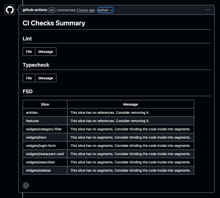
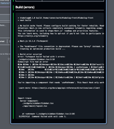

# FSD CI Checks

Steiger 기반 FSD 검사와 lint/type/build를 한 번에 실행하고, 결과를 Summary/PR 코멘트로 보기 쉽게 정리해주는 CI Action입니다.
FSD/타입/린트/빌드 상태를 한눈에 확인할 수 있어 PR 리뷰와 품질 확인이 빠릅니다.
English version: [README_EN.md](README_EN.md)
예시 PR: https://github.com/ksh5324/fsd-ci-check-example/pull/2

## Quick Start

1) 프로젝트에 `pnpm fsd:check`, `pnpm typecheck`, `pnpm build` 스크립트가 있는지 확인
2) `.node-version` 파일이 없다면 `setup-node`를 `node-version`으로 바꿔 사용
3) 아래 최소 예시를 워크플로에 추가

```yaml
jobs:
  checks:
    runs-on: ubuntu-latest
    steps:
      - uses: actions/checkout@v4
      - uses: actions/setup-node@v4
        with:
          node-version-file: .node-version
      - uses: pnpm/action-setup@v4
        with:
          version: 10.27.0
          run_install: false
      - uses: ksh5324/fsd-ci-action@v2
```

## 동작 방식

- `install`(선택) → `lint` → `typecheck` → `fsd` → `build` 순서로 실행됩니다.
- 각 명령의 종료 코드를 기록하고, 실패 시 로그를 파싱해 `issues.tsv`를 채웁니다. `ci-report.md`는 항상 요약을 생성합니다.
- 기본 설정에서는 체크 결과를 요약만 하고 워크플로를 실패시키지 않습니다.
  (필요하면 워크플로에서 출력값을 기준으로 성공/실패 정책을 커스터마이즈할 수 있습니다.)

## 전제조건

- Node.js 및 패키지 매니저(pnpm 기준)가 설치되어 있어야 합니다.
- `fsd-command`에서 사용하는 FSD 검사 도구(예: `steiger`)가 프로젝트에 설치되어 있어야 합니다.
- 기본값을 그대로 쓸 경우 `pnpm fsd:check` 스크립트가 프로젝트에 존재해야 합니다.

## 사용법

기본 사용법:

```yaml
jobs:
  checks:
    runs-on: ubuntu-latest
    steps:
      - uses: actions/checkout@v4
      - uses: actions/setup-node@v4
        with:
          node-version-file: .node-version
      - uses: pnpm/action-setup@v4
        with:
          version: 10.27.0
          run_install: false
      - uses: ksh5324/fsd-check-ci@v2
        with:
          working-directory: .
```

## 입력값

- `working-directory`: 작업 디렉터리 (기본: `.`)
- `run-install`: 설치 실행 여부 (기본: `true`)
- `install-command`: 설치 명령어 (기본: `pnpm install --frozen-lockfile`)
- `lint-command`: lint 명령어 (기본: `pnpm exec eslint . -f unix --max-warnings=0`)
- `typecheck-command`: typecheck 명령어 (기본: `pnpm typecheck`)
- `fsd-command`: FSD 검사 명령어 (기본: `pnpm fsd:check`)
- `run-build`: build 실행 여부 (기본: `true`)
- `build-command`: build 명령어 (기본: `pnpm build`)
- `comment-on-pr`: PR 코멘트 생성/갱신 여부 (기본: `false`)
- `comment-mode`: 코멘트 업데이트 모드 (`update`=append, `replace`=덮어쓰기) (기본: `replace`)
- `comment-header`: 기존 코멘트 찾기용 마커 (기본: `<!-- ci-checks-summary -->`)
- `github-token`: PR 코멘트 작성에 사용할 토큰 (기본: `GITHUB_TOKEN`)
- `upload-artifacts`: `ci-report.md`, `issues.tsv`, `*.log`를 아티팩트로 업로드 (기본: `false`)

## 출력값

- `lint-exit-code`: lint 명령의 종료 코드 (0=성공, 그 외=실패)
- `typecheck-exit-code`: typecheck 명령의 종료 코드
- `fsd-exit-code`: FSD 검사 명령의 종료 코드
- `build-exit-code`: build 명령의 종료 코드
- `fsd-has-errors`: FSD 오류 감지 여부 (0/1). FSD 로그가 특정 패턴을 포함할 때 1로 설정됩니다.

## 생성 파일

- `issues.tsv`: lint/typecheck/fsd 이슈를 탭 구분으로 기록한 파일
- `ci-report.md`: 이슈를 표로 정리한 요약 리포트. `GITHUB_STEP_SUMMARY`에도 자동으로 표시됩니다.
- 생성 위치는 `working-directory` 기준입니다.

## 표시 위치 / 활용

- `ci-report.md`와 동일한 요약이 Actions 실행 화면의 **Summary** 탭에 표시됩니다.
- 출력값은 워크플로에서 조건 분기나 실패 처리를 위해 사용할 수 있습니다.
  예: `if: ${{ steps.run-checks.outputs.lint-exit-code != '0' }}`

## 요약 출력 예시

`ci-report.md`는 아래처럼 테이블 형태로 생성됩니다(일부 예시).
동일한 내용이 Actions Summary 탭에 표시됩니다.

```markdown
<!-- ci-checks-summary -->
# CI Checks Summary

## Lint

| File | Message |
|---|---|
| src/app.ts | no-unused-vars: 'x' is assigned a value but never used |

## Typecheck

| File | Message |
|---|---|
| src/types.ts | TS2322: Type 'string' is not assignable to type 'number'. |

## FSD

| Slice | Message |
|---|---|
| features/auth | This slice should not depend on shared/ui |
```

## 예시 화면

실제 PR에 코멘트로 붙은 결과 화면



빌드 실패가 Summary/코멘트에 표시된 화면



lint + FSD 오류가 Summary/코멘트에 표시된 화면


## 참고

- FSD 파서는 `help/fsd-awk/parse-fsd-issues.sh`를 사용합니다.
- PR 코멘트나 실패 처리 로직은 워크플로에서 추가로 구성하세요.

## PR 코멘트로 사용하기

`ci-report.md` 내용을 PR 코멘트로 남기려면 아래 옵션을 사용하세요.
`GITHUB_TOKEN`을 사용할 경우 `permissions`에 `pull-requests: write`가 필요합니다.
`working-directory`를 변경했다면 `WORKDIR`와 경로도 같이 맞춰주세요.

```yaml
jobs:
  checks:
    runs-on: ubuntu-latest
    permissions:
      pull-requests: write
      contents: read
    env:
      WORKDIR: .
    steps:
      - uses: actions/checkout@v4
      - uses: actions/setup-node@v4
        with:
          node-version-file: .node-version
      - uses: pnpm/action-setup@v4
        with:
          version: 10.27.0
          run_install: false
      - uses: ksh5324/fsd-check-ci@v2
        with:
          working-directory: ${{ env.WORKDIR }}
          comment-on-pr: true
          comment-mode: replace
          comment-header: "<!-- ci-checks-summary -->"
          github-token: ${{ secrets.GITHUB_TOKEN }}
```

## 실패 처리(워크플로 실패로 만들기)

기본 설정은 요약만 생성하고 워크플로를 실패시키지 않습니다.
아래처럼 출력값을 확인해 실패 처리 스텝을 추가하세요.

```yaml
      - name: FSD CI Checks
        id: fsd
        uses: ksh5324/fsd-ci-action@v2
        with:
          working-directory: .

      - name: Fail if checks failed
        if: ${{ always() }}
        run: |
          lint_code="${{ steps.fsd.outputs.lint-exit-code }}"
          type_code="${{ steps.fsd.outputs.typecheck-exit-code }}"
          fsd_code="${{ steps.fsd.outputs.fsd-exit-code }}"
          build_code="${{ steps.fsd.outputs.build-exit-code }}"
          fsd_has_errors="${{ steps.fsd.outputs.fsd-has-errors }}"

          if [ "${lint_code:-0}" != "0" ] || \
             [ "${type_code:-0}" != "0" ] || \
             [ "${build_code:-0}" != "0" ] || \
             [ "${fsd_has_errors:-0}" = "1" ] || \
             [ "${fsd_code:-0}" != "0" ]; then
            echo "One or more checks failed."
            exit 1
          fi
```

## 그대로 붙여서 사용하는 전체 예시

PR 코멘트까지 포함된 실제 워크플로 예시입니다. 그대로 복사해 사용해도 됩니다.
아래 예시는 `pnpm` 기반 프로젝트를 기준으로 합니다.

필요한 준비 사항:

- Node.js와 `pnpm`이 설치된 환경
- `.node-version` 파일이 프로젝트에 존재 (또는 `setup-node` 입력을 직접 버전으로 변경)
- 프로젝트에 `pnpm fsd:check`, `pnpm typecheck`, `pnpm build` 스크립트가 존재
- FSD 검사 도구(예: `steiger`)가 프로젝트 의존성에 포함

## 전체 예시 플로우

워크플로는 아래 순서로 진행됩니다.

1) 체크아웃 → Node/pnpm 세팅 → 의존성 설치
2) 액션 실행 (lint/typecheck/fsd/build + 요약 생성)
3) 옵션에 따라 PR 코멘트 생성/갱신
4) 출력값을 기준으로 워크플로 성공/실패 결정

```yaml
name: CI

on:
  pull_request:

permissions:
  contents: read
  pull-requests: write

jobs:
  checks:
    runs-on: ubuntu-latest
    steps:
      - uses: actions/checkout@v4
      - uses: actions/setup-node@v4
        with:
          node-version-file: .node-version
      - uses: pnpm/action-setup@v4
        with:
          version: 10.27.0
          run_install: false
      - name: FSD CI Checks
        id: fsd
        uses: ksh5324/fsd-check-ci@v2
        with:
          working-directory: .
          comment-on-pr: true
          comment-mode: replace
          comment-header: "<!-- ci-checks-summary -->"
          github-token: ${{ secrets.GITHUB_TOKEN }}
          upload-artifacts: true
      - name: Fail if checks failed
        if: ${{ always() }}
        run: |
          lint_code="${{ steps.fsd.outputs.lint-exit-code }}"
          type_code="${{ steps.fsd.outputs.typecheck-exit-code }}"
          fsd_code="${{ steps.fsd.outputs.fsd-exit-code }}"
          build_code="${{ steps.fsd.outputs.build-exit-code }}"
          fsd_has_errors="${{ steps.fsd.outputs.fsd-has-errors }}"

          if [ "${lint_code:-0}" != "0" ] || \
             [ "${type_code:-0}" != "0" ] || \
             [ "${build_code:-0}" != "0" ] || \
             [ "${fsd_has_errors:-0}" = "1" ] || \
             [ "${fsd_code:-0}" != "0" ]; then
            echo "One or more checks failed."
            exit 1
          fi
```

FSD 파서 스크립트는 이 액션 내 `help/fsd-awk/parse-fsd-issues.sh`를 사용합니다.

## Q&A

Q. PR 코멘트가 안 달려요  
A. `comment-on-pr: true` 설정과 `permissions`의 `pull-requests: write`를 확인하세요. 포크 PR은 기본 토큰 권한이 제한됩니다.

Q. `ci-report.md`가 없다고 나와요  
A. `working-directory`를 변경했다면 경로가 실제 작업 디렉터리와 일치하는지 확인하세요.

Q. FSD가 항상 실패로 나와요  
A. `pnpm fsd:check` 스크립트와 FSD 검사 도구(예: `steiger`) 설치 여부를 확인하세요. 로그 포맷이 달라졌다면 파서가 매칭하지 못할 수 있습니다.

Q. `.node-version`이 없어요  
A. `actions/setup-node`에서 `node-version`을 직접 지정하세요.

Q. pnpm을 안 써요  
A. `install-command`, `lint-command`, `typecheck-command`, `fsd-command`, `build-command`를 npm/yarn 명령으로 변경해 사용하세요.
